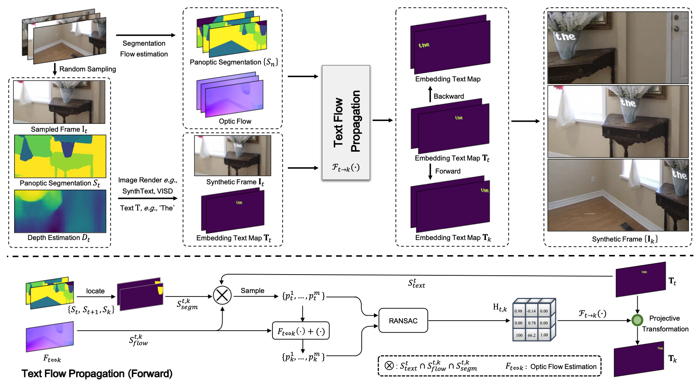

# ICME2023 《FlowText: Synthesizing Realistic Scene Text Video with Optical Flow Estimation》


<p align="center" width="100%">

</p>

 ## Get Started
 ### Environment Setup
 FlowText is based on the segmentation model [Mask2fomer](https://github.com/facebookresearch/Mask2Former), depth estimation model [Monodepth2](https://github.com/nianticlabs/monodepth2), optical flow estimation model [GMA](https://github.com/zacjiang/GMA), synthesis engine [SynthText](https://github.com/ankush-me/SynthText). To setup the environment of FlowText, we use `conda` to manage our dependencies. Our developers use `CUDA 11.1` to do experiments. You can specify the appropriate `cudatoolkit` version to install on your machine in the `requirements.txt` file, and then run the following commands to install FlowText:
 ```
conda create -n flowtext python=3.8
conda activate flowtext

pip install torch==1.9.0+cu111 torchvision==0.10.0+cu111 torchaudio==0.9.0 -f https://download.pytorch.org/whl/torch_stable.html

git clone https://github.com/callsys/FlowText
cd FlowText
pip install -r requirements.txt
 
git clone git@github.com:facebookresearch/detectron2.git
cd detectron2
pip install -e .
 
cd segmentation/mask2former/modeling/pixel_decoder/ops/
sh make.sh
 ```
### Download Models
To run FlowText, you need to download some files ([Google Drive](https://drive.google.com/drive/folders/1Be8jOjFOyhx8R4d5d7prRL1698xaGzsI?usp=sharing)), which mainly contain the font file for the synthesized text, the text source, and the weight of the models. Once you have downloaded the files, link them to the FlowText directory:
```
ln -s path/to/FlowText_data FlowText/data
```
### Generate Synthetic Videos with Full Annotations
Generate Synthetic video with demo video `assets/demo.mp4` and output to result to `assets`:
```
python gen.py
```
Generate Synthetic video with given video `video.mp4`, frame range `start,end,interval`, save path `save` and random seed `seed`:
```
python gen.py --video video.mp4 --range start,end,interval --save save --seed seed
```
For example:
```
python gen.py --video assets/demo.mp4 --range 0,400,5 --save assets/result --seed 16
```
### Output Format
The format of the file output by `gen.py` is as follows:
```
result
|
└─── 00000000.jpg
└─── 00000001.jpg
└─── 00000002.jpg
└─── ......
└─── 00000079.jpg
└─── ann.json
└─── viz.mp4
└─── viz_ann.mp4
```
where `xxx.jpg` denotes the synthetic video video frames, `ann.json` is the annotation file, `viz.mp4` is the synthetic video and `viz_ann.mp4` is the synthetic video with visualized annotations.
## Citation
If you use FlowText in your research or wish to refer to the results, please use the following BibTeX entry.
```
@inproceedings{zhao2023flowtext,
  title={FlowText: Synthesizing Realistic Scene Text Video with Optical Flow Estimation},
  author={Yuzhong Zhao and Weijia Wu and Zhuang Li and Jiahong Li and Weiqiang Wang},
  journal={ICME},
  year={2023}
}
```
## Organization
Affiliations: [University of Chinese Academy of Sciences](https://www.ucas.ac.cn), [Zhejiang University](https://www.zju.edu.cn/english/), [MMU of Kuaishou Technology](https://www.kuaishou.com/en)

Authors: Yuzhong Zhao ([zhaoyuzhong20@mails.ucas.ac.cn](zhaoyuzhong20@mails.ucas.ac.cn)), Weijia Wu ([weijiawu@zju.edu.cn](weijiawu@zju.edu.cn)), Zhuang Li ([lizhuang@kuaishou.com](lizhuang@kuaishou.com)) Jiahong Li ([lijiahong@kuaishou.com](lijiahong@kuaishou.com)) Weiqiang Wang ([wqwang@ucas.ac.cn](wqwang@ucas.ac.cn))
## Acknowledgement
Code is largely based on [SynthText](https://github.com/ankush-me/SynthText), and models are borrowed from [Mask2fomer](https://github.com/facebookresearch/Mask2Former),[Monodepth2](https://github.com/nianticlabs/monodepth2) and [GMA](https://github.com/zacjiang/GMA).

Work is fully supported by [MMU of Kuaishou Technology](https://www.kuaishou.com/en).
